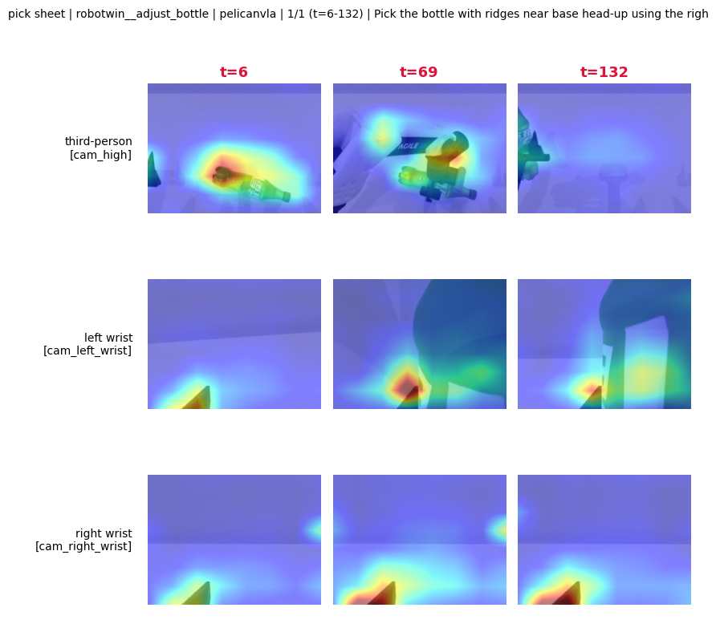

# attnvis

Attention visualization for [PelicanVLA](https://github.com/Open-X-Humanoid/Pelican-VLA05).
Dumps action→image attention as `.npz` per camera; ships a minimal montage figure
and `figlib` primitives so you can compose your own sheets from the `.npz`.

<p align="center"></p>

Flow:

```
① install attnvis   →   ② install PelicanVLA   →   ③ .env + preflight   →   ④ dump   →   ⑤ figures
```

Requirements: Python ≥ 3.10, system OpenCV runtime, CJK font (Linux) if instructions contain Chinese.

## ① Install attnvis

```bash
python -m venv .venv && . .venv/bin/activate
pip install -e '.[data]'          # figures + data readers
# pip install -e .                 # figures only — enough to re-render an existing outputs/dense/ tree
```

`[data]` adds `opencv-python`, `h5py`, `pyarrow`. Core is `numpy`, `matplotlib`, `scipy`, `Pillow`.
attnvis never installs `torch` / `transformers` / model weights — those belong to step ②.

## ② Install PelicanVLA

Follow `pelican_vla0.5_infer/README.md` in the PelicanVLA release
(pin list: `pelican_vla0.5_infer/requirements.txt`). Either install into the same
venv as ① or into a separate one and set `ATTNVIS_PELICANVLA_PY` (below).

Downloads:

- release code: <https://github.com/Open-X-Humanoid/Pelican-VLA05>
- checkpoint:   <https://huggingface.co/X-Humanoid/Pelican-VLA05>
- Qwen3-VL-4B:  <https://huggingface.co/Qwen>
- Cosmos tokenizer: <https://huggingface.co/nvidia/Cosmos-Tokenizer-CI8x8>

## ③ .env + preflight

Copy `.env.example` to `.env` and fill in your paths:

```bash
ATTNVIS_PELICANVLA_SRC=/path/to/pelican_vla0.5_infer
ATTNVIS_PELICANVLA_CKPT=/path/to/pelican_vla05_checkpoint
QWEN3_VL_PATH=/path/to/Qwen3-VL-4B-Instruct
COSMOS_TOKENIZER_PATH=/path/to/Cosmos-Tokenizer-CI8x8

# dataset roots — set the ones you have (HDF5 + LeRobot 3.0; see .env.example
# for the full list, and §Visualize on your own collected data below for
# adding a new v3 root)
ATTNVIS_ROBOTWIN_ROOT=/path/to/RoboTwin2_0_processed/robotwin

# optional: separate PelicanVLA venv
# ATTNVIS_PELICANVLA_PY=/path/to/pelicanvla_venv/bin/python

HF_HUB_OFFLINE=1
TRANSFORMERS_OFFLINE=1
```

Load env, preflight:

```bash
set -a && source .env && set +a
export PYTHONPATH=$PWD/src
python -m attnvis preflight robotwin:adjust_bottle:0
# expect: "preflight: OK"
```

Scene format: `source:suite[:episode]` (episode defaults to 0). Registered sources:
`libero`, `robotwin`, `tienkung`, `ur5e`, `ur5e_v3`, `ur5e_dual`, `franka_fr3`,
`agilex_jd`, `realsource_v30`. Suites per source live in `registry/embodiments.py`.

## ④ Dump

```bash
python -m attnvis run --scenes robotwin:adjust_bottle:0 --nframes 3 --exp case_study
```

Writes:

```
outputs/dense/case_study/robotwin__adjust_bottle/pelicanvla/
├── frames_<cam>.npz              # (T,H,W) heat, (T,H,W,3) rgb, frames, instruction
├── manifest.json
└── <cam>/                        # per-frame PNG overlay + contact_strip.png
```

Useful flags: `--preflight-only`, `--dry-run`, `--ckpt <path> --label <name>`,
`PELICANVLA_CAPTURE=twohop|direct|auto`.

## ⑤ Figures

Read only the `.npz` — no GPU, no model.

The built-in `fig montage` grids every `frame_*.png` a `dump` wrote into one
image per camera, so you can eyeball all sampled frames at a glance:

```bash
python -m attnvis fig montage --root outputs/dense/case_study
# writes outputs/dense/case_study/**/<cam>/_montage.png
```

Beyond that, `dump_dense` gives you the raw `frames_<cam>.npz` (heatmap +
rgb + frame indices + instruction) and `attnvis.figlib` gives you the
primitives (`blend`, `pct_vmax`, `pct_range`, `save_cell`, `setup_cjk_font`).
Compose your own figure in ~20 lines:

```python
import numpy as np, matplotlib.pyplot as plt
from attnvis.figlib import blend, pct_vmax, setup_cjk_font

setup_cjk_font()
z = np.load("outputs/dense/case_study/robotwin__adjust_bottle/pelicanvla/frames_cam_high.npz",
            allow_pickle=True)
heat, rgb, frames, instr = z["heat"], z["rgb"], z["frames"], str(z["instruction"])
vmax = pct_vmax(heat, p=99.5)

n = len(frames)
fig, axes = plt.subplots(1, n, figsize=(2.4 * n, 2.6))
for ax, ri, hi, t in zip(np.atleast_1d(axes), rgb, heat, frames):
    ax.imshow(blend(ri, hi, "turbo", vmin=0, vmax=vmax, alpha=0.5))
    ax.set_title(f"t={int(t)}", fontsize=10); ax.axis("off")
fig.suptitle(instr, fontsize=12)
plt.tight_layout(); plt.savefig("my_sheet.png", dpi=130, bbox_inches="tight")
```

---

## Visualize on your own collected data

You can run the same attention visualization on data you collected yourself —
the only requirement is that it is packaged as a **LeRobot 3.0 dataset**
(`meta/info.json` with `codebase_version="v3.0"`). attnvis reads any v3 dataset
out of the box; the reader lives in `sources/_lerobot_frame.py`. To wire your
own recording in, you (a) inspect its schema, then (b) register it in three
files. (If your data is in another format, convert it to LeRobot 3.0 first.)

### (a) Inspect the dataset

A v3 dataset is one directory:

```
<dataset_root>/
├── meta/
│   ├── info.json                                     # codebase_version="v3.0", fps, features{}
│   └── episodes/chunk-000/*.parquet                  # length, tasks, per-video-key from_timestamp / file_index / chunk_index
├── data/chunk-{c:03d}/file-{f:03d}.parquet           # per-frame state / action columns
└── videos/<video_key>/chunk-{c:03d}/file-{f:03d}.mp4 # one MP4 per camera stream
```

You need three things from it before registering:

```bash
python - <<'PY'
import json, pyarrow.parquet as pq, glob
ROOT = "/abs/path/to/dataset_root"
info = json.load(open(f"{ROOT}/meta/info.json"))
print("fps       :", info["fps"])
print("features  :", list(info["features"])[:12], "...")   # state/action column names live here
print("video_keys:", [k for k in info["features"] if info["features"][k].get("dtype") == "video"])
ep0 = pq.read_table(sorted(glob.glob(f"{ROOT}/meta/episodes/chunk-000/*.parquet"))[0]).to_pylist()[0]
print("tasks[0]  :", ep0.get("tasks"))
print("length    :", ep0["length"])
PY
```

The `video_keys` are the directory names under `videos/`. The state/action
columns are the keys in `features` you want to concatenate into a state vector.

### (b) Register in three files

1. `src/attnvis/registry/embodiments.py` — append one `Embodiment`. `Camera.key`
   is the exact `video_key` from step (a); `state_cols` are the `(column_name,
   dim)` pairs to concatenate:

    ```python
    "my_arm": Embodiment(
        name="my_arm", arm="dual", state_dim=14, loader="lerobot",
        cameras=[Camera("head",  "observation.images.head",  "third_person"),
                 Camera("left",  "observation.images.left",  "wrist"),
                 Camera("right", "observation.images.right", "wrist")],
        state_cols=[("observation.state", 14)],           # or split, e.g. [("arm.left", 7), ("arm.right", 7)]
        instruction_source="episode_tasks",               # or None → info.json.metadata.language_instruction
        tasks={"suite_a": "/abs/path/to/dataset_root"},   # add more suites here later
        default_suite="suite_a",
    ),
    ```

2. `src/attnvis/sources/robomind.py` — one-line subclass:

    ```python
    class MyArmSource(_RoboMINDSource):
        name = "my_arm"
    ```

3. `src/attnvis/dump_dense.py::_LEROBOT_SOURCES` — one entry
   (`"my_arm": "MyArmSource"`).

### Verify

```bash
python -m attnvis preflight my_arm:suite_a
python -c "from attnvis.sources.robomind import MyArmSource; \
  s=MyArmSource(suite='suite_a'); ts=s.pick_frames(0,3); f=s.get_frame(0,ts[1]); \
  print(ts, f.state.shape, f.instruction, {c:v.shape for c,v in f.rgb.items()})"
python -m attnvis run --scenes my_arm:suite_a:0 --nframes 3 --exp my_arm_smoke
```

### How the reader reads one frame

`extract_frame(dataset, episode_idx, frame_idx)` in `sources/_lerobot_frame.py`:
episode row → instruction (episode `tasks[0]` or `info.json.metadata.language_instruction`)
→ RGB (`frame_no = round(from_timestamp * fps) + frame_idx`, decode MP4 via OpenCV;
v3 packs several episodes back-to-back in one MP4, so the offset matters)
→ state (concat `Embodiment.state_cols` from the data parquet; missing parquet → zeros).

## Layout

| Path                          | Role                                        |
|-------------------------------|---------------------------------------------|
| `src/attnvis/config.py`       | Input paths, env vars                       |
| `src/attnvis/paths.py`        | Output paths                                |
| `src/attnvis/sources/`        | Dataset → `Frame`                           |
| `src/attnvis/adapters/`       | PelicanVLA policy call + attention capture  |
| `src/attnvis/dump_dense.py`   | Runs the adapter, writes `.npz`             |
| `src/attnvis/figs/`           | Composite figures from `.npz`               |
| `src/attnvis/registry/`       | Embodiments + preflight                     |

## License

Apache-2.0. Weights and third-party code keep their own licenses.
