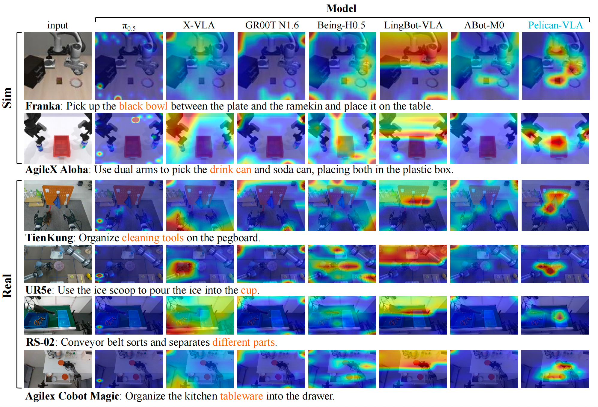
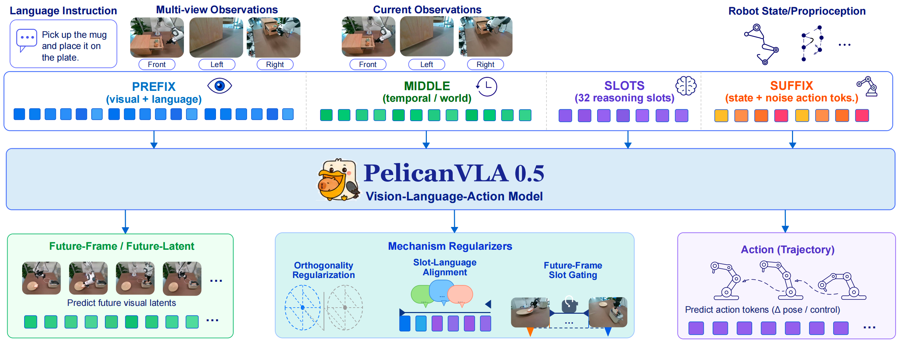
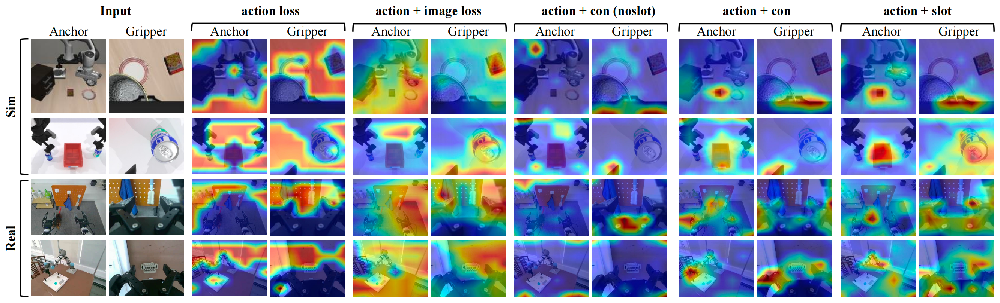
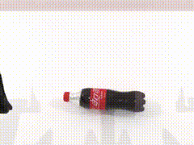
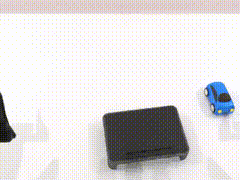
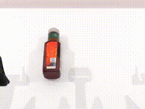
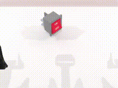

<h1 align="center">Pelican-VLA 0.5: Attending Before Acting Benefits Generalization</h1>

<p align="center">
  <a href="https://arxiv.org/pdf/2607.06655"></a>
  <a href="https://github.com/Open-X-Humanoid/Pelican-VLA05"></a>
  <a href="https://huggingface.co/X-Humanoid/Pelican-VLA05"></a>
  <a href="https://huggingface.co/X-Humanoid/Pelican-VLA05-Robotwin"></a>
  <a href="LICENSE"></a>
</p>

<p align="center">
  
</p>
<p align="center">
  <em>Attention visualization comparison with open-source VLA baselines in the zero-shot setting.
  Before task-specific fine-tuning, Pelican-VLA 0.5 directs its action-pathway attention to the
  instruction-relevant object and contact area, while other open-source VLA models show more
  diffuse attention over the robot arm, surrounding objects, or background.</em>
</p>

## Overview

**Pelican-VLA 0.5** is a unified Vision-Language-Action (VLA) model that integrates
vision-language understanding, future-frame generation, and action prediction within a
single shared [Qwen3-VL 4B](https://huggingface.co/Qwen) backbone. It is built by the
**WFM System Group** at the Beijing Innovation Center of Humanoid Robotics (X-Humanoid).

A central goal of VLA research is generalization across objects, scenes, tasks, and
embodiments. Yet most VLA models attend *diffusely*, spreading attention across the robot
arm, background clutter, and task-irrelevant objects. Pelican-VLA 0.5 instead achieves
**attention-level generalization**: without object annotations, segmentation masks,
attention supervision, or task-specific fine-tuning, its action pathway already
concentrates on the instruction-relevant object and its contact region. This behavior
persists across unseen scenes and unseen robot embodiments.

The key design is a compact set of learnable **bottleneck tokens** inserted between
perception and action. Rather than letting the action pathway attend directly to dense
visual tokens, the bottleneck tokens form a fixed-capacity interface that routes manipulation-relevant
information into action generation. We verify that this manipulation-centric attention is
induced specifically by the bottleneck tokens, and that it transfers even to a MoT-style
architecture.

<p align="center">
  
</p>
<p align="center">
  <em>Overview of Pelican-VLA 0.5. A shared Qwen3-VL 4B backbone unifies visual-language
  understanding, future-frame prediction, and action generation. The input sequence contains
  four segments — vision-language <b>prefix</b>, temporal/world <b>middle</b> latents, 32
  learnable <b>bottleneck tokens</b>, and a <b>suffix</b> of state and noisy action tokens. A
  single forward pass predicts future-frame latents, a compact task representation, and action
  denoising velocities.</em>
</p>

After fine-tuning on RoboTwin, Pelican-VLA 0.5 reaches **91.4%** success on *RoboTwin Clean*
and **91.0%** on *RoboTwin Randomized*, the best average among open-source VLA baselines.

<p align="center">
  
</p>
<p align="center">
  <em>Component-wise ablation. Auxiliary losses alone (action / +image / +contrastive) do not
  induce object-centric attention; the manipulation-centric pattern emerges only when
  perception is routed through the bottleneck tokens (action + bottleneck token).</em>
</p>

> Pelican-VLA 0.5 is an *intermediate* model toward truly generalizable VLA. It has already
> achieved strong attention-level generalization during pre-training, but a
> **representation-to-action gap** remains: it can begin to identify *what* to attend to,
> while reliable execution across new scenes, objects, and embodiments still requires
> stronger action-level generalization.

## News

* **[2026-07-08]** The Pelican-VLA 0.5 [technical report](https://arxiv.org/abs/2607.06655)
  is released.
* **[2026-07-14]** Model weights, inference code, and visualization code will be released.
* **[2026-08-04]** Training code will be open-sourced.

## TODO

* **July 14, 2026:** release the model weights, inference code, and visualization code.
* **August 4, 2026:** open-source the training code.

## Visualization and Reproducibility

On July 14, 2026, we will release visualization tools that can load our pre-trained model
and run on your own collected data. These tools are intended to help users verify whether
the model's attention focuses on the task-relevant object, the gripper, and the actionable
manipulation region.

We also commit that **RoboTwin data was not used during pre-training**. On August 4, 2026,
we will release the training code so the community can train the model and reproduce the
RoboTwin zero-shot evaluation.

## Model Download

The pre-trained backbone and the RoboTwin fine-tuned checkpoint will be released on
July 14, 2026.

| Model Name              | Hugging Face                                                                          | Description                                            |
| ----------------------- | ------------------------------------------------------------------------------------- | ------------------------------------------------------ |
| Pelican-VLA 0.5         | [Pelican-VLA05](https://huggingface.co/X-Humanoid/Pelican-VLA05)                   | Cross-embodiment pre-trained model (~2,400 hours)      |
| Pelican-VLA 0.5 RoboTwin| [Pelican-VLA05-Robotwin](https://huggingface.co/X-Humanoid/Pelican-VLA05-Robotwin) | Fine-tuned on RoboTwin 2.0 (clean + randomized)        |

To train or run Pelican-VLA 0.5, weights from **Qwen3-VL-4B-Instruct** (backbone
initialization) and the frozen **NVIDIA Cosmos-Tokenizer** (visual history / future-frame
branch) are also required.

```bash
# Available beginning July 14, 2026
# Download the pre-trained model
huggingface-cli download X-Humanoid/Pelican-VLA05 --local-dir ./pretrained_model

# Download the RoboTwin fine-tuned model
huggingface-cli download X-Humanoid/Pelican-VLA05-Robotwin --local-dir ./robotwin_model
```

## Performance on RoboTwin

On the RoboTwin 2.0 benchmark, Pelican-VLA 0.5 achieves the best average success rate among
open-source VLA baselines in both the clean and randomized settings. The gap between the two
settings is only 0.4 points, indicating that the policy does not rely on the nominal
appearance of the scene.

| Method            | Clean    | Randomized | Average  |
| ----------------- | -------- | ---------- | -------- |
| π₀                | 80.0     | 79.5       | 79.8     |
| π₀.₅              | 86.8     | 87.0       | 86.9     |
| X-VLA             | 72.9     | 72.8       | 72.9     |
| StarVLA-OFT       | 88.2     | 88.3       | 88.3     |
| ABot-M0           | 86.1     | 85.1       | 85.6     |
| LingBot-VLA       | 88.6     | 86.7       | 87.7     |
| Qwen-VLA          | 86.1     | 87.2       | 86.7     |
| JoyAI-RA          | 90.5     | 89.3       | 89.9     |
| Hy-VLA            | 90.9     | 90.1       | 90.5     |
| **Pelican-VLA 0.5** | **91.4** | **91.0**   | **91.2** |


## Zero-shot in RoboTwin

Without any task-specific fine-tuning, the pre-trained Pelican-VLA 0.5 is deployed directly
on held-out RoboTwin 2.0 tasks under unseen objects, unseen scene layouts, and a new robot
embodiment. The policy reaches toward the correct instruction-relevant object and produces
coherent, goal-directed motions — an early glimmer of generalization that emerges from the
manipulation-centric attention formed during pre-training.

<table>
  <tr>
    <td width="25%"><a href="asset/picking-up-bottle.mp4"></a></td>
    <td width="25%"><a href="asset/placing-a-toy-car-onto-a-platform.mp4"></a></td>
    <td width="25%"><a href="asset/picking-up-a-beverage-bottle.mp4"></a></td>
    <td width="25%"><a href="asset/turning-on-a-switch.mp4"></a></td>
  </tr>
</table>

> View the original MP4 demos:
> [picking-up-bottle.mp4](asset/picking-up-bottle.mp4) ·
> [placing-a-toy-car-onto-a-platform.mp4](asset/placing-a-toy-car-onto-a-platform.mp4) ·
> [picking-up-a-beverage-bottle.mp4](asset/picking-up-a-beverage-bottle.mp4) ·
> [turning-on-a-switch.mp4](asset/turning-on-a-switch.mp4)

## Limitations

Pelican-VLA 0.5 is an intermediate stage toward practical zero-shot manipulation. The
remaining **attention-to-action gap** is attributed mainly to data scale and action
representation: the current checkpoint is trained on only ~2,400 hours of heterogeneous
manipulation data and uses joint-position actions, which are more embodiment-specific than
end-effector pose representations.

Our next step is to scale both data and action experience. We plan to release a stronger
version trained on approximately **7,000 hours** of manipulation data, superseding the current
2,400-hour checkpoint, along with improved action parameterization and stricter data curation.

## Citation

If you find our work useful in your research, please cite:

```bibtex
@article{ding2026pelican,
  title={Pelican-VLA 0.5: Attending Before Acting Benefits Generalization},
  author={Ding, Zeyuan and Liu, Wenhai and Xu, Yang and Hu, Jiayu and Chen, Yinda and
          Zhang, Yi and Dai, Yong and Tang, Jian and Ju, Xiaozhu},
  journal={arXiv preprint arXiv:2607.06655},
  year={2026},
  url={https://arxiv.org/abs/2607.06655}
}
```

## License

This project is licensed under the **Apache-2.0 License**. See [`LICENSE`](LICENSE).
Third-party components (LeRobot, openpi, Hugging Face Transformers, NVIDIA Cosmos) are
Apache-2.0 and attributed accordingly.

## Acknowledgement

We sincerely thank the developers of [LeRobot](https://github.com/huggingface/lerobot),
[openpi](https://github.com/Physical-Intelligence/openpi),
[Qwen3-VL](https://github.com/QwenLM/Qwen3-VL), and
[NVIDIA Cosmos](https://github.com/NVIDIA/Cosmos). This project benefits from their
contributions to the open-source community.
